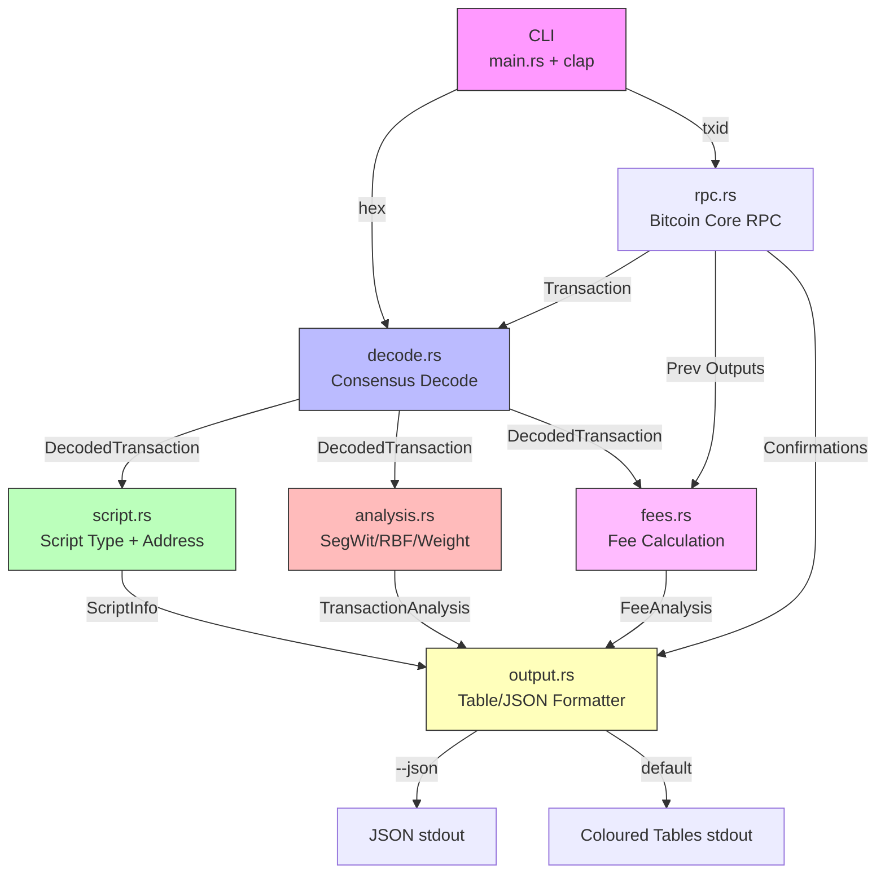

# Architecture — Bitcoin Transaction Explorer

## System Overview



## Module Responsibilities

| Module | Responsibility | Key Types |
|--------|---------------|-----------|
| `main.rs` | CLI entry point, argument parsing, orchestration | `Cli`, `Commands` |
| `lib.rs` | Public API re-exports | — |
| `decode.rs` | Consensus-decode raw bytes → structured `DecodedTransaction` | `DecodedTransaction`, `DecodedInput`, `DecodedOutput` |
| `script.rs` | Identify script type (P2PKH/P2SH/P2WPKH/P2WSH/P2TR/OP_RETURN/P2PK), derive address | `ScriptType`, `ScriptInfo` |
| `analysis.rs` | SegWit detection, RBF signalling, size/weight/vsize summary | `TransactionAnalysis` |
| `fees.rs` | Fee calculation from input/output sums | `FeeAnalysis` |
| `output.rs` | Format as human-readable tables with colours, or JSON | `ExplorationResult` |
| `rpc.rs` | Bitcoin Core RPC client: fetch tx, previous outputs, confirmations | `BitcoinRpc` |
| `error.rs` | Typed error enum for the library | `ExplorerError` |

## Data Flow

```
1. User provides raw hex or txid
2. If txid: RPC fetches the Transaction
3. decode.rs: Transaction → DecodedTransaction
4. script.rs: For each output, identify script type + derive address
5. analysis.rs: SegWit variant, RBF, weight/vsize
6. fees.rs: If RPC available, fetch prev outputs → fee + fee rate
7. output.rs: ExplorationResult → terminal tables or JSON
```

## Offline vs Online

| Feature | Offline (`hex`) | Online (`txid`) |
|---------|:---:|:---:|
| Decode all fields | ✅ | ✅ |
| Script type + address | ✅ | ✅ |
| Size / weight / vsize | ✅ | ✅ |
| SegWit / RBF detection | ✅ | ✅ |
| Fee calculation | ❌ | ✅ |
| Confirmation status | ❌ | ✅ |

Fee calculation requires previous output values, which are not included in the serialized transaction. The `hex` command shows "Fee: —" with a note. The `txid` command fetches previous outputs via RPC and computes the fee.

## Error Handling Strategy

- **Library** (`lib.rs`, all modules): `thiserror` → typed `ExplorerError` enum
- **Application** (`main.rs`): `anyhow` → ergonomic error chains with `.context()`

This gives downstream consumers of the library typed errors to match on, while the CLI gets human-readable error reports.
